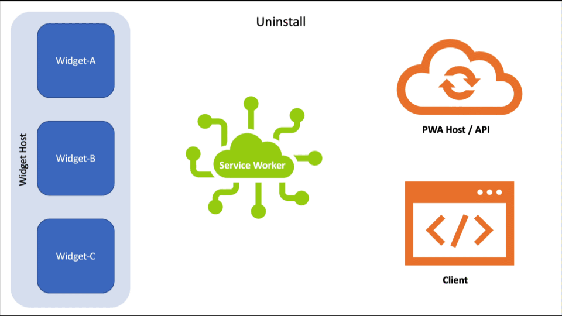

# PWA widgets

Playing with some ideas around widget definitions for PWAs.

**Note: These are my own ideas and are not reflective of anything my employer may or may not do in the future. I am just doing some thinking around what Widgets could be like if we were able to connect them to a PWA.**

## The idea

For the last few years, I’ve been thinking about the many ways native applications can expose information and/or focused tasks within operating systems. Examples of this include Android Home Screen Widgets, macOS Dashboard and Today Panel Widgets, the Apple Touch Bar, Samsung Daily Cards, Mini App Widgets, smart watch app companions, and so on. When building Progressive Web Apps, it would useful to be able to project aspects of the web app onto these surfaces (originally I’d considered these "projections" but most systems do call them "widgets," so I opted to go with the flow).

Here are a few use cases:

* A streaming video service could offer access to all of the shows or movies you have in your queue that is distinct from the actual player. It might live in a widget on one device, but, with access to all of the plumbing of the PWA itself, could enable users to control the services’ PWA running on the user’s smart TV.
* A stock tracking app could offer a widget for viewing current stock prices for stocks you are watching.
* A calendar service could provide a daily agenda at a glance.
* A music identification service could have a button widget that, when clicked, would access the microphone and attempt to ID the currently playing song.

It’s expected that each <a href="#dfn-widget-host">Widget Host</a> will provide different opportunities and have different constraints that depend on a variety of factors including memory use and power management. As such, this proposal outlines a means of defining two alternative approaches within the same Widget definition (`WidgetDefinition`) that would accommodate both scenarios:

1. [Templated Widgets](#Templated-Widgets)
2. [Rich Widgets](#Rich-Widgets)

Under this proposal, developers would be free to define Widgets that support both approaches or only one. In supporting only one, they should be aware that choosing a single path may limit the distribution/install-ability of that Widget.

## Definitions

Nouns:

<dl>
  <dt id="dfn-widget">Widget</dt>
  <dd>A discrete user experience that represents a part of a website or app’s functionality. Refers to the prototypical definition of an experience (e.g., follow an account), *not* the <a href="#dfn-widget-instance">individual representations of this widget</a> (e.g., follow bob) that exist in a <a href="#dfn-widget-host">Widget Host</a>.</dd>
  <dt id="dfn-widget-host">Widget Host</dt>
  <dd>A container that manages and renders widgets.</dd>
  <dt id="dfn-widget-instance">Widget Instance</dt>
  <dd>The interactive experience of a <a href="#dfn-widget">Widget</a> within a <a href="#dfn-widget-host">Widget Host</a>. Multiple instances of a Widget may exist within a <a href="#dfn-widget-host">Widget Host</a>. These distinct instances may have associated <a href="#dfn-widget-settings">settings</a>.</dd>
  <dt id="dfn-widget-settings">Widget Settings</dt>
  <dd>Configuration options, defined on a <a href="#dfn-widget">Widget</a> and unique to a <a href="#dfn-widget-instance">Widget Instance</a>, that enable that instance to be customized.</dd>
  <dt id="dfn-widget-provider">Widget Provider</dt>
  <dd>An application that exposes Widgets. A browser would likely be the Widget Provider on behalf of its PWAs and would act as the proxy between those PWAs and any <a href="#dfn-widget-service">Widget Service</a>.</dd>
  <dt id="dfn-widget-registry">Widget Registry</dt>
  <dd>The list of <a href="#dfn-install">installable</a> <a href="#dfn-widget">Widgets</a> <a href="#dfn-register">registered</a> by <a href="#dfn-widget-provider">Widget Providers</a>.</dd>
  <dt id="dfn-widget-service">Widget Service</dt>
  <dd>Manages communications between <a href="#dfn-widget-host">Widget Hosts</a> and <a href="#dfn-widget-provider">Widget Providers</a>.</dd>
</dl>

Verbs:

<dl>
  <dt id="dfn-install">Install</dt>
  <dt id="dfn-instantiate">Instantiate</dt>
  <dd>Create a <a href="#dfn-widget-instance">Widget Instance</a>.</dd>
  <dt id="dfn-register">Register</dt>
  <dd>Add a <a href="#dfn-widget">Widget</a> to the <a href="#dfn-widget-registry">Widget Registry</a>.</dd>
  <dt id="dfn-uninstall">Uninstall</dt>
  <dd>Destroy a <a href="#dfn-widget-instance">Widget Instance</a>.</dd>
  <dt id="dfn-unregister">Unregister</dt>
  <dd>Remove a <a href="#dfn-widget">Widget</a> from the <a href="#dfn-widget-registry">Widget Registry</a>.</dd>
</dl>


## Templated Widgets

In resource-limited scenarios, a <a href="#dfn-widget-host">Widget Host</a> may choose to provide a set of built-in widget templates that are minimally-customizable by developers (similar to [the Notifications API](https://notifications.spec.whatwg.org/#lifetime-and-ui-integrations)) through use of the PWA’s `icons`, `theme_color`, `background_color`, and so on. Examples include an agenda, calendar, mailbox, and a task list. The full list of available templates will likely vary by <a href="#dfn-widget-host">Widget Host</a>. This proposal suggests [list of widgets template types](#Suggested-template-types) as a reasonable starting point.

Templated Widgets support user interaction through one or more [developer-defined `WidgetAction` objects](#Defining-a-WidgetAction)s, which are analogous to a [`NotificationAction`](https://notifications.spec.whatwg.org/#dictdef-notificationaction).

### Suggested template types

For social and productivity apps:

* calendar-agenda
* calendar-day
* calendar-week
* calendar-month

For address books, directories, and social apps:

* contacts-list
* contacts-item

For general purposes (e.g., news, promotions, media, social):

* content-carousel
* content-feed
* content-item

For productivity apps:

* email-list
* task-item
* task-list

For auth-requiring Widgets:

* login-prompt

### Data flow in a Templated Widget

Data flow in a Templated Widget is largely managed in two ways:

1. Data flows from the Service Worker to a Widget instance via the `updateWidget()` method.
2. Data (in the form of interaction) flows from the Widget to the Service Worker via a `WidgetEvent` `tag`-ed to the specific Widget.

Here is an example of how this might look in the context of a Periodic Sync:

<figure id="periodic-sync">


</figure>

This video shows the following steps:

1. As part of a Periodic Sync, the Service Worker makes a Request to the host or some other endpoint.
2. The Response comes back.
3. As the Service Worker is aware of which widgets rely on that data, via the `WidgetDefinition` provided during install, the Service Worker can identify which widgets need updating. (This is internal logic and not shown in the video).
3. The Service Worker takes that data—perhaps packaging it with other instructions—and uses `showWidget()` to update the specific widgets that make use of that data.

To show a more complicated set of examples, consider what should happen if certain Widgets depend on authentication and the user happens to log out in the PWA or a browser tab. The developers would need to track this and ensure the Service Worker is notified so it can replace any auth-requiring Widgets with a prompt back into the app to log in.

Here’s how that might work:

<figure id="user-logout">


</figure>

This video shows:

1. The user logging out from the context of a Client. When that happens, the Client, sends a `postMessage()` to the Service Worker, alerting it to the state change in the app.
2. The Service Worker maintains a list of active Widgets and is aware of which ones require authentication. Knowing it’s been revoked, it pushes a new template to each auth-requiring Widget with a notice and a button to prompt the user to log in again.

The next step in this flow would be for the use to log back in. They could do that directly in the Client, but let’s use the `WidgetAction` provided in the previous step:

<figure id="user-login">


</figure>

This video shows:

1. The user clicking the "Login" action in the Widget. This triggers a `WidgetEvent` called "login".
2. The Service Worker is listening for that action and redirects the user directly to the login page of the app, either in an existing Client or a new Client (if one is not open).
3. The user logs in and the app sends a `postMessage()` to the Service Worker letting it know the user is authenticated again.
4. The Service Worker grabs new data from the network.
5. The Service Worker pipes that data back into the auth-requiring Widgets.

You can see more examples in [the `WidgetEvent` section](#Widget-related-Events).

## Rich Widgets

There are instances in which a templated widget is incapable of accomplishing the goal of a widget (e.g., turning on the microphone to identify the song that’s playing, frequently updating to display an accurate clock). For those instances, developers will a lot more control. This is where Rich Widgets come in. Rich Widgets are wholly developer managed at a URL they control.

As fully-rendered web pages (analogous to an `iframe`), Rich Widgets need to come with some restrictions that protect user privacy and limit stress on system resources. Each <a href="#dfn-widget-host">Widget Host</a> will likely have its own set of restrictions for Rich Widgets (if it even allows them). These will likely include:

1. Limited RAM footprint - *recommendation TBD*,
2. Limited JavaScript execution time - *recommendation TBD*,
3. Permissions-governed API usage (e.g., location, microphone) would require user interaction to activate,
4. Initiating any multimedia playback requires user interaction (though "piggybacking" on pre-existing multimedia playback initiated from within the same origin would not be similarly restricted), and
5. Data updates must be performed by the Service Worker.

Additionally, the <a href="#dfn-widget-host">Widget Host</a> will likely reserve the right to suspend a widget at any time. Looking at how many renderers handle suspension, it’s likely that many <a href="#dfn-widget-host">Widget Hosts</a> will create a bitmap representation of a Widget in its last-known state. The origin’s Service Worker may periodically request to update the Widget (and create a new snapshot) when it’s not in use.[^1] For more on this, consult the [events section](#Events).

Given that the web is responsive, a Rich Widget’s dimensions should not matter much. The content would merely adapt to the available real estate. Some <a href="#dfn-widget-host">Widget Hosts</a> may even support user resizing of a Widget.

### Caveats

Rich Widgets must exist within [the scope of the Manifest](https://www.w3.org/TR/appmanifest/#scope-member) in which they are defined.

A Widget’s network connection and update cycle is governed by a [Service Worker that applies to its scope](https://www.w3.org/TR/service-workers/#service-worker-registration-scope) and executes at the <a href="#dfn-widget-host">Widget Host</a>’s (and/or OS’) discretion.

## Internationalization

A widget’s [language](https://www.w3.org/TR/appmanifest/#lang-member) and [text direction](https://www.w3.org/TR/appmanifest/#dir-member) are inherited from the Web App Manifest in which it is defined. See also [Web App Manifest Internationalization](https://w3c.github.io/manifest/#internationalization).


## Defining a Widget

One or more Widgets are defined within the `widgets` member of a Web App Manifest. The `widgets` member would be an array of `WidgetDefinition` objects.

### Sample `WidgetDefinition` Object

```json
{
  "name": "Agenda",
  "tag": "agenda",
  "url": "/widgets/agenda/",
  "type": "text/calendar",
  "template": "agenda",
  "data": "/widgets/data/agenda.ical",
  "auth": true,
  "update": 900,
  "icons": [ ],
  "backgrounds": [ ],
  "actions": [ ],
  "settings": [ ]
}
```

### Required properties

The `name` value is a `DOMString` that will serve as the title of the widget presented to users.

The `tag` value is a `DOMString` that will serve as a way to reference the widget within the Service Worker as a `WidgetClient` and is analogous to a [Notification `tag`](https://notifications.spec.whatwg.org/#tag). `WidgetClient` still needs to be defined, but will be similar to [`WindowClient`](https://www.w3.org/TR/service-workers/#ref-for-dfn-window-client).


### Rich Widget properties

A [Rich Widget](#Rich-Widgets) MUST include a `url` property, which is a valid `URL` string pointing to the Widget’s HTML. That URL MUST exist within [the scope of the Web App Manifest](https://w3c.github.io/manifest/#dfn-scope) and [the scope of the Service Worker](https://w3c.github.io/ServiceWorker/#dom-serviceworkerregistration-scope).

*Note: Rich Widgets will likely be resource-limited, so developers are advised to avoid relying on large client-side libraries to render and update Rich Widgets.*

### Templated Widget properties

A [Templated Widget](#Templated-Widgets) MUST include the following properties:

* `data` - the `URL` where the data for the widget can be found; if the format is unsupported, the widget would not be offered.
* `type` - the MIME type of the data feed for the widget; if unsupported, the widget would not be offered.
* `template` - the template the developer would like the <a href="#dfn-widget-host">Widget Host</a> to use; if unsupported, the host may offer an analogous widget experience (determined using the `type` value) or the widget would not be offered.

A developer MAY define the following display-related properties:

* `icons` - an array of alternative icons to use in the context of this Widget; if undefined, the Widget icon will be the chosen icon from [the Manifest’s `icons` array](https://w3c.github.io/manifest/#icons-member).
* `backgrounds` - an array of alternative background images (as [`ImageResource` objects](https://www.w3.org/TR/image-resource/)) that could be used in the template (if the <a href="#dfn-widget-host">Widget Host</a> and template support background images).

A Manifest’s [`theme_color`](https://w3c.github.io/manifest/#theme_color-member) and [`background_color`](https://w3c.github.io/manifest/#background_color-member), if defined, may also be provided alongside this data.

A developer MAY define the following UI-related properties:

* `actions` - An array of [`WidgetAction` objects](#Defining-a-WidgetAction) that will be exposed to users (if the template supports them) and trigger an event within the origin’s Service Worker.
* `settings` - A array of [`WidgetSetting` objects](#Defining-a-WidgetSetting) that enable multiple instances of the same widget to be configured differently within a <a href="#dfn-widget-host">Widget Host</a> (e.g., a weather widget that displays a single locale could be installed multiple times, targeting different cities).

A developer MAY define the following informational properties as a means of decoupling widget-specific business logic from their Service Worker code:

* `auth` - Boolean as to whether or not the Widget requires auth. False if not included.
* `update` - the frequency (in seconds) a developer wishes for the widget to be updated; for use in registering a Periodic Sync. The actual update schedule will use the Service Worker’s Periodic Sync infrastructure.

### Defining a `WidgetAction`

A `WidgetAction` uses the same structure as a [Notification Action](https://notifications.spec.whatwg.org/#dictdef-notificationaction):

```json
{
  "action": "create-event",
  "title": "New Event",
  "icons": [ ]
}
```

The `action` and `title` properties are required. The `icons` array is optional but the icon may be used in space-limited presentations with the `title` providing its [accessible name](https://w3c.github.io/aria/#dfn-accessible-name).

When activated, a `WidgetAction` will dispatch a [`WidgetEvent`](#WidgetEvent) (modeled on [`NotificationEvent`](https://notifications.spec.whatwg.org/#example-50e7c86c)) within its Service Worker. Within the Service Worker, the event will contain a payload that includes a reference to the Widget itself and the `action` value.

### Defining a `WidgetSetting`

A `WidgetSetting` defines a single field for use in a widget’s setting panel.

```json
{
  "label": "Where do you want to display weather for?",
  "name": "locale",
  "description": "Just start typing and we’ll give you some options",
  "type": "autocomplete",
  "options": "/path/to/options.json?q={{ value }}",
  "default": "Seattle, WA USA"
}
```

Breaking this down:

* `label` is the visible text shown to the end user and acts as the accessible label for the field.
* `name` is the internal variable name used for the field (and is the key that will be sent back to the PWA).
* `description` is the _optional_ accessible description for a field, used to provide additional details/context.
* `type` is the field type that should be used. Support for the following field types are recommended:
  * Basic text field types: "text" || "email" || "password" || "tel" || "url" || "number"
  * One of many selection (requires `options`): "boolean" || "radio" || "select"
  * Many of many selection (requires `options`): "checkbox"
  * Temporal: "date" || "datetime"
  * Other: "file" || "color" || "range"
  * Auto-complete (requires `options`): "autocomplete"
* `options` is used for specific field `type`s noted above. It can be either an array of options for the field or a URL string referencing an endpoint expected to return an array of values. If the list is dynamic (as in the case of an autocomplete field), the URL endpoint may be passed the current `value` of the field via the reference "{{ value }}".
* `default` is the _optional_ default value for the setting.

### Extensibility

We recognize that some widget platforms may allow developers to further refine a Widget’s appearance and/or functionality within their system. We recommend that those platforms use [the extensibility of the Manifest](https://www.w3.org/TR/appmanifest/#extensibility) to allow developers to encode their widgets with this additional information, if they so choose.

For example, if using something like [Microsoft’s Adaptive Cards](https://docs.microsoft.com/en-us/adaptive-cards/templating/) for rendering, a <a href="#dfn-widget-host">Widget Host</a> might consider adding something like the following to the `WidgetDefinition`:

```json
"ms-ac-template": "/widgets/templates/agenda.ac.json",
```

## Service Worker APIs

This proposal introduces a `widgets` attribute to the [`ServiceWorkerGlobalScope`](https://www.w3.org/TR/service-workers/#serviceworkerglobalscope-interface). This attribute references the `Widgets` interface (which is analogous to `Clients`) that exposes the following:

* `get()` - Requires an <var>id</var> argument that matches the internal `id` of a Widget. Returns a Promise that resolves to a `Widget` or *undefined*.
* `matchAll()` - Requires [an `options` argument](#Options-for-Matching). Returns a Promise that resolves to an array of `Widget` objects, regardless of their status, or an empty array.
* `show()` - Returns a Promise that resolves to  *undefined* or Error.

### The `Widget` Object

Each Widget is represented within the `Widgets` interface as a `Widget`. Each Widget’s representation includes the original `WidgetDefinition` (as `definition`), but is mainly focused on providing details on the Widget’s current state and enables easier interaction with the <a href="#dfn-widget-host">Widget Host</a>(s):

```js
{
  "tag": "agenda",
  "installable": true,
  "hasSettings": false,
  "definition": { },
  "instances": [ ]
}
```

All properties are Read Only to developers and are updated by the implementation as appropriate.

* `tag` - String. The `tag` used to reference the Widget.
* `installable` - Boolean. Indicates whether the Widget is installable (based on Widget type and/or data format).
* `hasSettings` - Boolean. Indicates whether the `WidgetDefinition` includes a non-empty `settings` array.
* `definition` - Object. The original, unaltered, `WidgetDefinition` provided by the Manifest. Includes any [proprietary extensions](#Extensibility)).
* `instances` Array of `WidgetInstance` objects. Represents the current state of each instance of a widget (from the perspective of the Service Worker). Empty if the widget has not been installed.

### The `WidgetInstance` Object

```js
{ 
  "id": {{ GUID }},
  "host": {{ GUID }},
  "settings": { },
  "updated": {{ Date() }},
  "payload": { }
}
```

All properties are Read Only to developers and are updated by the implementation as appropriate.

* `id` - String. The GUID used to reference the `WidgetInstance` by the implementor.
* `host` - String. Internal pointer to the <a href="#dfn-widget-host">Widget Host</a> that has installed this `WidgetInstance`.
* `settings` - Object. If the Widget has settings, the key/values pairs set for this instance are enumerated here.
* `updated` - Date. Timestamp for the last time data was sent to the `WidgetInstance` (via `show()`).
* `payload` - Object. The last payload sent to this `WidgetInstance` (via `show()`).

### Options for Matching

The `matchAll` method is analogous to `clients.matchAll()`, but is limited in scope to only "widget" type clients. It also allows developers to limit the scope of matches based on any of the following:

* `tag: tagname` - Only matches a Widget that has the <var>tagname</var> `tag`.
* `installable: true` - Only matches Widgets supported by a <a href="#dfn-widget-host">Widget Host</a> on this device.
* `installed: true` - Only matches Widgets that are currently installed on this device (determined by looking for 1+ members of each Widget’s `instances` array).

#### New `ClientType`

Widgets should be a part of the `Clients` interface. As such, a new [ClientType](https://w3c.github.io/ServiceWorker/#ref-for-enumdef-clienttype) of "widget" would need to be defined.

### Showing a Widget

Developers will use `widgets.show()` to both create and update Widgets. The method takes one argument, <var>payload</var> which is an object that provides the <a href="#dfn-widget-host">Widget Host</a> with the necessary information for rendering the widget. The members are:

* `definition` - Object. The `WidgetDefinition` for the Widget.
* `data` - Object. The data to flow into it.
* `instance` - Object. Optional. The `instance` to create/update.
* `tag` - String. Optional. Used to update all instances of a Widget.
* `host` - String. Optional. Used to target a specific <a href="#dfn-widget-host">Widget Host</a>.

This method will resolve undefined if successful, but should throw a descriptive Error if one is encountered. For example:

* "Widget Host not found"
* "Widget template not supported"
* "Widget instance not found"
* "Data required by the template was not supplied."

_Note: instead of resolving to undefined if successful, it could resolve with a widget instance id or a reference to the widget instance itself._

## Widget-related Events

There are a host of different events that will take place in the context of a Service Worker. For simplicity, all come through the `widgetClick` event listener.

A `WidgetEvent` is an object with the following properties:

* `host` - This is the GUID for the host (and is used for internal bookkeeping, such as which host is requesting install/uninstall).
* `action` - This is the primary way you will disambiguate events. The names of the events may be part of a standard lifecycle or app-specific, based on any [`WidgetAction` that has been defined](#Defining-a-WidgetAction).
* `widget` - This is a reference to the Widget itself. As with Notifications, this object provides access to details about the Widget, most importantly its instance `id` and `tag`, which would be used to update the widget using `show()` or save its settings using `saveSettings()`.
* `data` - This object comprises key/value pairs representing data sent from the <a href="#dfn-widget-host">Widget Host</a> as part of the event.

```js
{
  "host": {{ GUID }},
  "action": "create-event",
  "widget": {
    "id": {{ GUID }},
    "tag": "agenda",
    "actions": [ ]
  },
  "data": { }
}
```

You can see a basic example of this in use in [the user login video, above](user-login). There is a walk through of the interaction following that video, but here’s how the actual `WidgetEvent` could be handled:

```js
self.addEventListener('widgetclick', function(event) {

  const action = event.action;

  // If user is being prompted to login 
  if ( action == "login" ) {
    // open a new window to the login page
    clients.openWindow( "/login?from=widget" );
  }

});
```

There are a few special `WidgetEvent` `action` types to consider as well. 

* "WidgetInstall" - Executed when a <a href="#dfn-widget-host">Widget Host</a> is requesting installation of a widget.
* "WidgetUninstall" - Executed when a <a href="#dfn-widget-host">Widget Host</a> is requesting un-installation of a widget.
* "WidgetSave" - Executed when a Widget has settings and the user saves the settings for a specific `WidgetInstance`.
* "WidgetResume" - Executed when a <a href="#dfn-widget-host">Widget Host</a> is switching from its inactive to active state.

<p id="install">Here is the flow for install:</p>


1. A "WidgetInstall" signal is received by the User Agent and is passed along to the Service Worker.
2. The Service Worker
    a. captures the Widget `tag` from the `widget` property,
    b. looks up the Widget via `widgets.matchAll()`, and
    c. makes a `Request` for its `data` endpoint.
3. The Service Worker then combines the `Response` with the Widget definition and passes that along to the <a href="#dfn-widget-host">Widget Host</a> via the `show()` method.
4. Internally, a new `WidgetInstance` is created — with default `settings` values, if `settings` are defined — and gets pushed into the `instances` array of the corresponding `Widget`.

<p id="uninstall">The "uninstall" process is similar:</p>



1. The "WidgetUninstall" signal is received by the User Agent.
2. Internally, the `WidgetInstance` associated with the `host` value of the corresponding `WidgetDefinition` is deleted.
3. If successful, the "WidgetUninstall" event is issued to the Service Worker.
3. The Service Worker runs any necessary cleanup steps (such as un-registering a Periodic Sync if the widget is no longer in use).

<p id="save">The "WidgetSave" process works like this:</p>

1. The "WidgetSave" signal is received by the User Agent.
2. Internally, the `WidgetInstance` matching the `widget.id` value and `host` is examined to see if
    a. it has settings and
    b. its `settings` object matches the inbound `data`.
3. If it has settings and the two do not match, the new data is saved to the `WidgetInstance` and the "WidgetSave" event issued to the Service Worker.
4. The Service Worker receives the event and can react by issuing a request for new data, based on the updated settings values.

<p id="resume">The final special event is "WidgetResume." Many <a href="#dfn-widget-host">Widget Hosts</a> will suspend the rendering surface when it is not in use (to conserve resources). In order to ensure Widgets are refreshed when the rendering surface is presented, the <a href="#dfn-widget-host">Widget Host</a> will issue a "WidgetResume" event. Unlike "WidgetInstall," "WidgetUninstall," and "WidgetSave," the "WidgetResume" event does not include a reference to an individual Widget. The Service Worker will need to enumerate its `WidgetClients` and Fetch new data for each.</p>


Here is how each of these events could be handled in the Service Worker:

```js
self.addEventListener('widgetclick', function(event) {

  const action = event.action;
  const tag = event.widget.tag;
  const id = event.widget.id;
  const host = event.host;
  
  event.waitUntil(
    // get the Widget
    const widget = wigets
                    .matchAll({ tag: tag });

    // Get the instance
    const instance = widget.instances
                       .filter(instance => instance.id == id);
    
    // If a widget is being installed
    switch action:
      case "WidgetInstall":
        console.log("installing", widget);
        
        // get the data needed
        fetch( widget.data )
          .then( response => {

            // show the widget, passing in 
            // the widget definition and data
            widgets.show({
              definition: widget.definition,
              tag: tag,
              host: host,
              data: response.body
            });

          });
        return;
      
      case "WidgetUninstall":
        console.log("uninstall", widget);
        
        // do any cleanup that’s needed
        
        return;

      case "WidgetResume":
        console.log("resuming all widgets");

        // refresh the data on each widget (using Clients, just to show it can be done)
        clients
          .matchAll({ type: "widget" })
          .then(function(widgetList) {
            for (let i = 0; i < widgetList.length; i++) {
              var widget = clientList[i];
              // Widgets with settings should be updated on a per-instance level
              if ( widget.hasSettings )
              {
                widget.instances.map(instance => {
                  let settings_data = new FormData();
                  for ( let key in instance.settings ) {
                    settings_data.append(key, instance.settings[key]);
                  }
                  fetch( widget.data, {
                    method: "POST",
                    body: settings_data
                  })
                  .then( response => {
                    widgets.show({
                      instance: instance.id,
                      definition: widget.definition,
                      data: response.body
                    });
                  });
                });
              // other widgets can be updated en masse via their tags
              } else {
                fetch( widget.data )
                  .then( response => {
                    widgets.show({
                      tag: widget.tag,
                      definition: widget.definition,
                      data: response.body
                    });
                  });
              }
            }
          });

        return;
      
      // other cases
    }
  );

});
```

[^1]: "In use" defined as user interaction + X minutes.
 